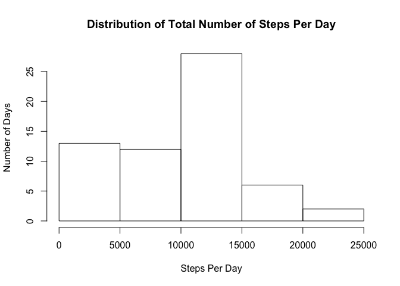
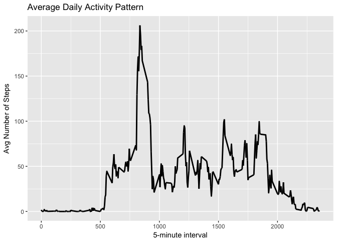
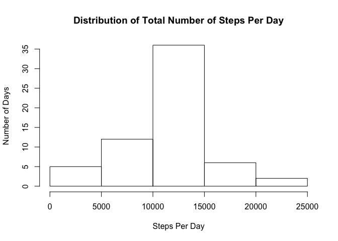
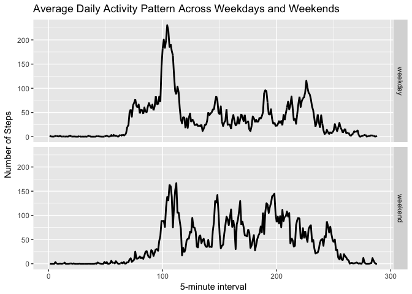

## Loading and preprocessing the data

```r
# Reads data from zip and csv
unzip("activity.zip")
activity <- read.csv("activity.csv")

# Shows what read data looks like
library(xtable)
head.activity <- xtable(head(activity))
print(head.activity, type="html")
```

<!-- html table generated in R 3.4.2 by xtable 1.8-2 package -->
<!-- Tue Jan  2 01:52:48 2018 -->
<table border=1>
<tr> <th>  </th> <th> steps </th> <th> date </th> <th> interval </th>  </tr>
  <tr> <td align="right"> 1 </td> <td align="right">  </td> <td> 2012-10-01 </td> <td align="right">   0 </td> </tr>
  <tr> <td align="right"> 2 </td> <td align="right">  </td> <td> 2012-10-01 </td> <td align="right">   5 </td> </tr>
  <tr> <td align="right"> 3 </td> <td align="right">  </td> <td> 2012-10-01 </td> <td align="right">  10 </td> </tr>
  <tr> <td align="right"> 4 </td> <td align="right">  </td> <td> 2012-10-01 </td> <td align="right">  15 </td> </tr>
  <tr> <td align="right"> 5 </td> <td align="right">  </td> <td> 2012-10-01 </td> <td align="right">  20 </td> </tr>
  <tr> <td align="right"> 6 </td> <td align="right">  </td> <td> 2012-10-01 </td> <td align="right">  25 </td> </tr>
   </table>

  
## What is mean total number of steps taken per day?

```r
# 1a. Calculates the total number of steps taken per day
stepsPerDay <- with(activity, tapply(steps, date, sum, na.rm=TRUE))
head.stepsPerDay <- xtable(as.data.frame(head(stepsPerDay)))
print(head.stepsPerDay, type="html")
```

<!-- html table generated in R 3.4.2 by xtable 1.8-2 package -->
<!-- Tue Jan  2 01:52:49 2018 -->
<table border=1>
<tr> <th>  </th> <th> head(stepsPerDay) </th>  </tr>
  <tr> <td align="right"> 2012-10-01 </td> <td align="right">   0 </td> </tr>
  <tr> <td align="right"> 2012-10-02 </td> <td align="right"> 126 </td> </tr>
  <tr> <td align="right"> 2012-10-03 </td> <td align="right"> 11352 </td> </tr>
  <tr> <td align="right"> 2012-10-04 </td> <td align="right"> 12116 </td> </tr>
  <tr> <td align="right"> 2012-10-05 </td> <td align="right"> 13294 </td> </tr>
  <tr> <td align="right"> 2012-10-06 </td> <td align="right"> 15420 </td> </tr>
   </table>

```r
# 1b. Draws historgram of total number of steps taken each day
hist(stepsPerDay, 
        main = "Distribution of Total Number of Steps Per Day", 
        xlab="Steps Per Day", 
        ylab="Number of Days")
```

<!-- -->

```r
# 2a. Calculates and report the mean total number of 
#     steps taken per day
mean(stepsPerDay)
```

[1] 9354.23

```r
# 2b. Calculates and report the median total number of 
#     steps taken per day
median(stepsPerDay)
```

[1] 10395


## What is the average daily activity pattern?

```r
# 1. Make a time series plot (i.e. type = "l") of the 5-minute interval (x-axis) 
#    and the average number of steps taken, averaged across all days (y-axis)
library("ggplot2")
library("data.table")
library("zoo")
```

```
## 
## Attaching package: 'zoo'
```

```
## The following objects are masked from 'package:base':
## 
##     as.Date, as.Date.numeric
```

```r
activity <- data.table(activity)
stepsPerInterval <- activity[, byInterval:= mean(steps, na.rm=TRUE), by=list(interval)]
a<- ggplot(stepsPerInterval, aes(x=interval, y=byInterval))
a+geom_line(lwd=1)+
        ggtitle("Average Daily Activity Pattern")+
        labs(x="5-minute interval",y="Avg Number of Steps")
```

<!-- -->

```r
# 2. Which 5-minute interval, on average across all the days in the dataset,      
#    contains the maximum number of steps?
timeInterval<- unique(stepsPerInterval$interval[stepsPerInterval$byInterval==max(stepsPerInterval$byInterval)])
```
On average across all the days in the dataset, the 5-minute interval beginning at `timeInterval` contains the maximum number of steps.

## Imputing missing values

```r
# 1. Calculate and report the total number of missing values in the dataset (i.e. the total number of 
#    rows with 𝙽𝙰s)
lapply(activity, function(x) sum(is.na(x)))
```

$steps
[1] 2304

$date
[1] 0

$interval
[1] 0

$byInterval
[1] 0

```r
# 2. Devise a strategy for filling in all of the missing values in the dataset. The strategy does not 
#    need to be sophisticated. For example, you could use the mean/median for that day, or the mean for 
#    that 5-minute interval, etc.

# Fills NAs with mean steps for interval
activity.fill <- activity[, stepsFilled:= ifelse(is.na(steps), byInterval,steps)]

# 3. Create a new dataset that is equal to the original dataset but with the missing data filled in.
activity.fill$date <-as.Date(activity.fill$date)
```

```
## Warning in strptime(xx, f <- "%Y-%m-%d", tz = "GMT"): unknown timezone
## 'zone/tz/2017c.1.0/zoneinfo/Europe/London'
```

```r
activity.fill$interval <-as.factor(activity.fill$interval)

activity.new <- data.table(cbind(activity.fill$stepsFilled, activity.fill$date, activity.fill$interval))
setnames(activity.new, c("steps","date", "interval"))
activity.new$date <-as.Date(activity.new$date)

head.activity.new <- xtable(as.data.frame(head(activity.new)))
print(head.activity.new, type="html")
```

<!-- html table generated in R 3.4.2 by xtable 1.8-2 package -->
<!-- Tue Jan  2 01:52:50 2018 -->
<table border=1>
<tr> <th>  </th> <th> steps </th> <th> date </th> <th> interval </th>  </tr>
  <tr> <td align="right"> 1 </td> <td align="right"> 1.72 </td> <td align="right"> 15614.00 </td> <td align="right"> 1.00 </td> </tr>
  <tr> <td align="right"> 2 </td> <td align="right"> 0.34 </td> <td align="right"> 15614.00 </td> <td align="right"> 2.00 </td> </tr>
  <tr> <td align="right"> 3 </td> <td align="right"> 0.13 </td> <td align="right"> 15614.00 </td> <td align="right"> 3.00 </td> </tr>
  <tr> <td align="right"> 4 </td> <td align="right"> 0.15 </td> <td align="right"> 15614.00 </td> <td align="right"> 4.00 </td> </tr>
  <tr> <td align="right"> 5 </td> <td align="right"> 0.08 </td> <td align="right"> 15614.00 </td> <td align="right"> 5.00 </td> </tr>
  <tr> <td align="right"> 6 </td> <td align="right"> 2.09 </td> <td align="right"> 15614.00 </td> <td align="right"> 6.00 </td> </tr>
   </table>

```r
#  4. Make a histogram of the total number of steps taken each day and calculate and report the mean 
#     and median total number of steps taken per day. Do these values differ from the estimates from 
#     the first part of the assignment? What is the impact of imputing missing data on the estimates 
#     of the total daily number of steps?

# Makes histogram of the total number of steps taken each day
stepsPerDay.new <- with(activity.new, tapply(steps, date, sum, na.rm=TRUE))
hist(stepsPerDay.new, 
        main = "Distribution of Total Number of Steps Per Day", 
        xlab="Steps Per Day", 
        ylab="Number of Days")
```

<!-- -->

```r
# Calculates and report the mean total number of steps taken per day
mean(stepsPerDay.new)
```

[1] 10766.19

```r
# Calculates and report the median total number of steps taken per day
median(stepsPerDay.new)
```

[1] 10766.19

```r
# Check whether means are the same
mean(stepsPerDay.new) == mean(stepsPerDay) 
```

[1] FALSE

```r
meanSteps <- ifelse(mean(stepsPerDay.new) > mean(stepsPerDay), "higher", "lower" )

# Check whether means are the same
median(stepsPerDay.new) == median(stepsPerDay) 
```

[1] FALSE

```r
medianSteps <- ifelse(median(stepsPerDay.new) > median(stepsPerDay) , "higher", "lower" )
```
The impact of imputing missing data makes the mean number of daily steps higher, and the median higher.


## Are there differences in activity patterns between weekdays and weekends?

```r
# 1. Create a new factor variable in the dataset with two levels – “weekday” and “weekend” indicating 
#    whether a given date is a weekday or weekend day.
activity.new[,weekday:=ifelse(grepl("Saturday|Sunday",weekdays(date)),"weekend", "weekday")]

# 2. Make a panel plot containing a time series plot (i.e. 𝚝𝚢𝚙𝚎 = "𝚕") of the 5-minute interval (x-
#    axis) and the average number of steps taken, averaged across all weekday days or weekend days 
#    (y-axis). See the README file in the GitHub repository to see an example of what this plot should 
#    look like using simulated data.

steps <- activity.new[, byInterval:= mean(steps, na.rm=TRUE), by=list(interval, weekday)]
b<- ggplot(steps, aes(x=interval, y=byInterval))
b+geom_line(lwd=1)+
        facet_grid(weekday~.)+
        ggtitle("Average Daily Activity Pattern Across Weekdays and Weekends")+
        labs(x="5-minute interval",y="Number of Steps")
```

<!-- -->
